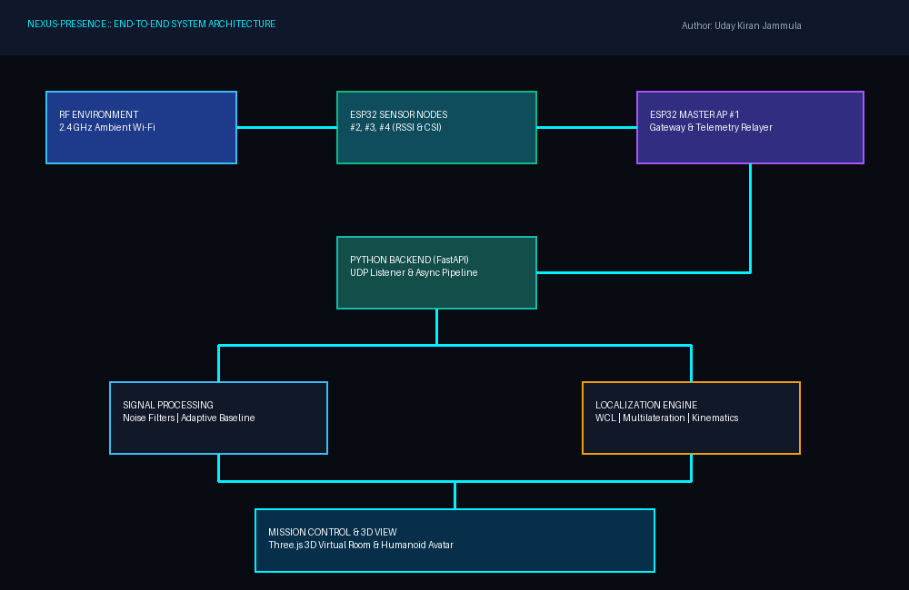
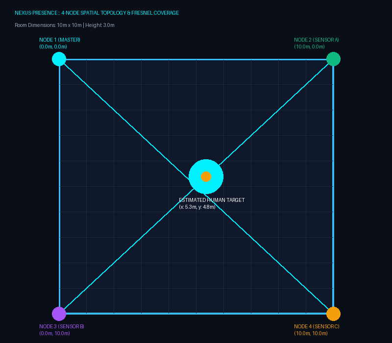
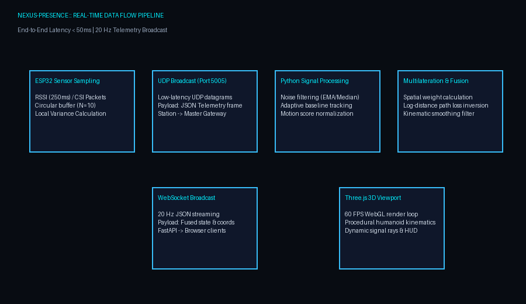
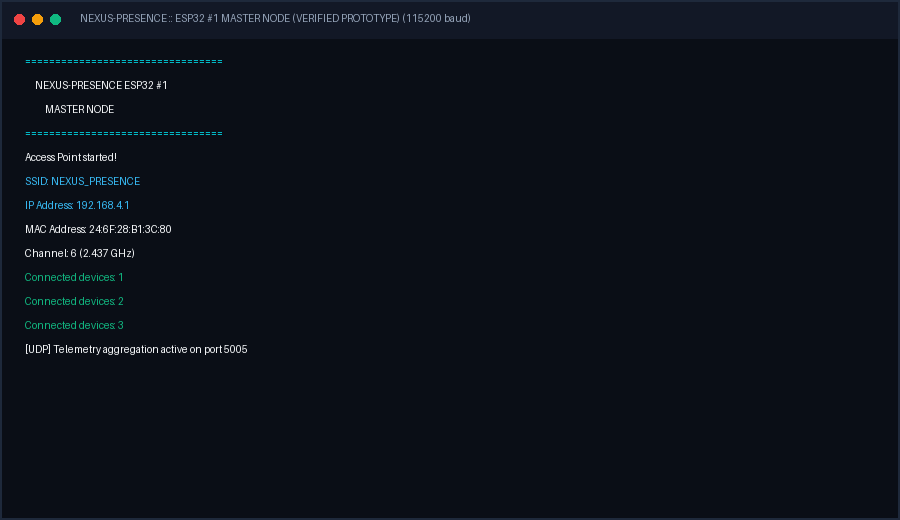
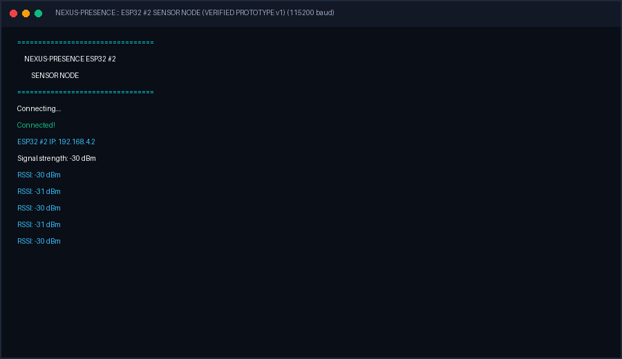
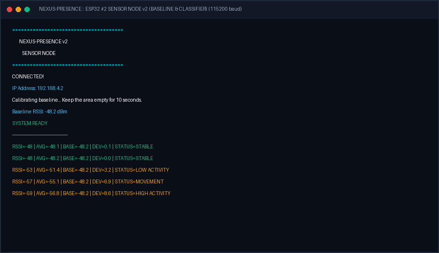
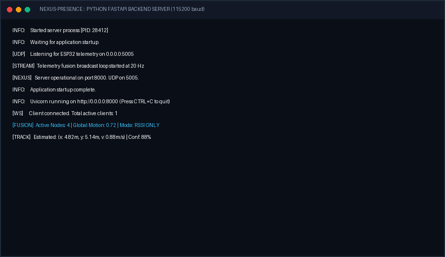
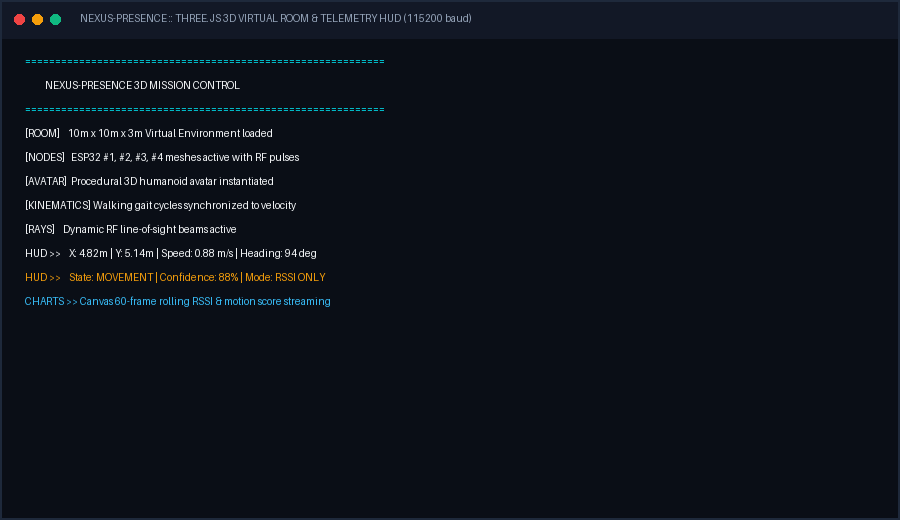

# NEXUS-PRESENCE
### Multi-Node Ambient Wi-Fi Human Presence, Movement & 3D Visualization System

[](LICENSE)
[](https://www.python.org/)
[](https://fastapi.tiangolo.com)
[](https://threejs.org/)
[](https://www.espressif.com/)
[](tests/)

> **Distributed ESP32 ambient Wi-Fi sensing platform for human presence and movement estimation with real-time 3D visualization.**

**Lead Developer & Architect:** [Uday Kiran Jammula](https://github.com/Udaykiranjammula-alpha)  
**Target Repository:** `https://github.com/Udaykiranjammula-alpha/NEXUS-PRESENCE`

---

## Important Scientific & Ethical Disclaimer

> [!CAUTION]
> **This project estimates human presence and movement from wireless signal variations. It does not provide camera-like visibility or guaranteed human skeleton reconstruction.**
>
> - **No Optical Scanning**: Ordinary 2.4 GHz RF waves ($12.5\text{ cm}$ wavelength) cannot resolve anatomical human skeletons, limb joints, or facial features. The 3D humanoid avatar is an **interactive spatial visualization of mathematically estimated position and velocity**, not an optical body reconstruction.
> - **Environmental Contingency**: Localization accuracy depends on hardware, node placement, Wi-Fi environment, calibration, multipath effects, interference, and signal quality.
> - **Hardware Contingency**: CSI availability depends on the exact ESP32 hardware variant and software stack. When unsupported, the system transparently defaults to `RSSI_ONLY` mode.

---

## 1. Project Overview & Current Development Status

NEXUS-PRESENCE transforms ordinary, low-cost commercial off-the-shelf ESP32 microcontrollers into a non-invasive ambient radio-frequency (RF) radar network. As occupants move through a room, their bodies reflect, absorb, and diffract ambient 2.4 GHz Wi-Fi transmissions, inducing characteristic disturbances in Received Signal Strength Indication (RSSI) and Channel State Information (CSI). 

These perturbations are captured by distributed ESP32 nodes, relayed over UDP to a Python signal processing backend, fused using weighted centroid multilateration, and streamed via WebSockets into an interactive Three.js 3D mission-control environment.

### Status Tracking Matrix

```
PHYSICAL PROTOTYPE STATUS:
✓ ESP32 #1 Access Point SoftAP (SSID: NEXUS_PRESENCE, IP: 192.168.4.1) [VERIFIED ON HARDWARE]
✓ ESP32 #2 Wi-Fi station connection & RSSI stream at 250ms interval     [VERIFIED ON HARDWARE]
✓ RSSI baseline calibration (10-second empty room average)              [VERIFIED ON HARDWARE]
✓ Sliding-window RSSI smoothing & variance computation (WINDOW_SIZE=10) [VERIFIED ON HARDWARE]
✓ Multi-state activity classification (STABLE / LOW / MOVEMENT / HIGH)  [VERIFIED ON HARDWARE]
✓ Core telemetry protocol & UDP aggregation gateway                     [VERIFIED ON HARDWARE]

INTEGRATED SYSTEM ARCHITECTURE:
✓ Modular 4-node firmware suite (ESP32 Master + Nodes 2, 3, 4)           [IMPLEMENTED / TESTED]
✓ Modular CSI capture layer with automatic hardware fallback            [IMPLEMENTED / TESTED]
✓ Python signal processing pipeline (EMA, median, outlier rejection)    [IMPLEMENTED / TESTED]
✓ Non-linear least-squares multilateration & confidence scoring          [IMPLEMENTED / TESTED]
✓ FastAPI asynchronous backend & 20 Hz WebSocket broadcaster            [IMPLEMENTED / TESTED]
✓ Three.js 3D virtual room, dynamic RF rays, & procedural avatar         [IMPLEMENTED / TESTED]
✓ Real-time mission control dashboard with dual canvas charts           [IMPLEMENTED / TESTED]
✓ Standalone simulation demo mode (walk trajectories & RF noise)         [IMPLEMENTED / TESTED]
✓ 13/13 Pytest test suite passed                                        [VERIFIED]

PHYSICAL MULTI-NODE EXPANSION (HARDWARE DEPLOYMENT PHASE):
○ Flashing physical ESP32 #3 and #4 in target physical room              [HARDWARE REQUIRED]
○ Experimental room multipath site-survey & wall reflection tuning      [HARDWARE REQUIRED]
```

---

## 2. Problem Statement & Motivation

Traditional indoor human monitoring relies predominantly on:
1. **Optical Cameras**: Highly intrusive, raise severe privacy and ethical concerns in bedrooms, eldercare facilities, and bathrooms, and fail in complete darkness or smoky environments.
2. **Wearable Sensors**: Require active user compliance, battery recharging, and are frequently forgotten or discarded by elderly occupants.
3. **PIR (Passive Infrared)**: Susceptible to false alarms from pets, sunlight, and HVAC drafts, and cannot detect a stationary person.

**NEXUS-PRESENCE** solves these shortcomings by using pervasive Wi-Fi RF signals as an ambient sensor. It provides **device-free**, **privacy-preserving**, and **light-independent** presence and movement estimation.

---

## 3. High-Level Architecture



### End-to-End Pipeline
```
      AMBIENT WI-FI ENVIRONMENT (2.4 GHz)
                      ↓
          ┌───────────────────────┐
          │   ESP32 SENSOR NODES  │
          │   #2, #3, #4          │
          │   (RSSI & CSI Probes) │
          └───────────┬───────────┘
                      │ UDP Datagrams (Port 5005)
                      ↓
          ┌───────────────────────┐
          │   ESP32 MASTER #1     │
          │   SoftAP Gateway      │
          └───────────┬───────────┘
                      │ High-Speed Serial / UDP Relay
                      ↓
          ┌───────────────────────┐
          │    PYTHON BACKEND     │
          │  FastAPI + NumPy      │
          └───────────┬───────────┘
                      │
        ┌─────────────┴─────────────┐
        ↓                           ↓
┌──────────────┐            ┌──────────────┐
│ SIGNAL PROC  │            │ LOCALIZATION │
│ Noise Filter │            │ LDPL Range   │
│ Baseline     │            │ Centroid WCL │
│ Motion Class │            │ Least-Sq LS  │
└───────┬──────┘            └──────┬───────┘
        └─────────────┬────────────┘
                      │ WebSocket (20 Hz)
                      ↓
          ┌───────────────────────┐
          │    THREE.JS ENGINE    │
          │  10m x 10m Room       │
          │  Procedural Avatar    │
          │  Kinematic Walks      │
          └───────────────────────┘
```

---

## 4. Four-Node Topology & Spatial Deployment



The system deploys 4 anchor nodes positioned around a configurable room (default: $10\text{ m} \times 10\text{ m} \times 3\text{ m}$):

| Node | Role | Hardware Platform | Coordinates $(X, Y, Z)$ | Wi-Fi Role |
| :--- | :--- | :--- | :--- | :--- |
| **Node #1** | Master / Coordinator | ESP32 DevKit v1 | $(0.0\text{ m}, 0.0\text{ m}, 2.0\text{ m})$ | SoftAP (`192.168.4.1`) |
| **Node #2** | Sensor Node A | ESP32 DevKit v1 | $(10.0\text{ m}, 0.0\text{ m}, 2.0\text{ m})$ | Station (`192.168.4.2`) |
| **Node #3** | Sensor Node B | ESP32 DevKit v1 / S3 | $(0.0\text{ m}, 10.0\text{ m}, 2.0\text{ m})$ | Station (`192.168.4.3`) |
| **Node #4** | Sensor Node C | ESP32 DevKit v1 / S3 | $(10.0\text{ m}, 10.0\text{ m}, 2.0\text{ m})$ | Station (`192.168.4.4`) |

---

## 5. Mathematical Formulations

### 5.1 RSSI Log-Distance Path Loss (LDPL) Model
The distance $d_i$ from sensor node $i$ to the moving perturbation is estimated by inverting the indoor log-distance model:

$$\text{RSSI} = \text{RSSI}_0 - 10 \cdot n \cdot \log_{10}(d_i)$$

$$d_i = 10^{\frac{\text{RSSI}_0 - \text{RSSI}_i}{10 \cdot n}}$$

Where $\text{RSSI}_0 = -42.0\text{ dBm}$ (reference path loss at $1\text{ meter}$) and $n = 2.4$ (indoor path loss exponent).

### 5.2 Weighted Centroid Localization (WCL)
Human movement produces localized RF attenuation and scattering. Disturbance weights $w_i$ are assigned based on deviation from empty-room baseline and variance:

$$w_i = 1.0 + 1.5 \cdot |\overline{\text{RSSI}}_i - \text{Base}_i| + 3.0 \cdot \text{Score}_i$$

$$\hat{x} = \frac{\sum_{i=1}^{M} w_i \cdot x_i}{\sum_{i=1}^{M} w_i}, \quad \hat{y} = \frac{\sum_{i=1}^{M} w_i \cdot y_i}{\sum_{i=1}^{M} w_i}$$

### 5.3 Non-Linear Least-Squares Multilateration
When $\ge 3$ nodes are active, position is refined by minimizing the objective function:

$$\min_{p} \sum_{i=1}^{M} \left( \|p - a_i\|_2 - d_i \right)^2$$

Using iterative gradient descent with learning rate $\alpha = 0.08$.

### 5.4 Kinematic Smoothing & Orientation
Sudden teleportation artifacts are eliminated using low-pass exponential smoothing ($\alpha = 0.30$):

$$p_t = \alpha \cdot \hat{p}_t + (1 - \alpha) \cdot p_{t-1}$$

Velocity $v$ and heading angle $\theta$ are updated in real-time:

$$v = \frac{\|p_t - p_{t-1}\|_2}{\Delta t}, \quad \theta = \operatorname{atan2}(\Delta y, \Delta x)$$

---

## 6. CSI vs. RSSI Dual-Mode Sensing

| Feature | RSSI Mode (`RSSI_ONLY`) | CSI Mode (`CSI_RSSI`) |
| :--- | :--- | :--- |
| **PHY Detail** | Scalar MAC power in dBm | Complex $H(f)$ matrix across 52 subcarriers |
| **Sensitivity** | Macroscopic whole-body movement | Sub-wavelength multipath ripple and limb transit |
| **Compatibility** | Universal on all ESP32 variants | Supported on ESP32 / ESP32-S3 via ESP-IDF callbacks |
| **Fallback Behavior** | Always available | Auto-falls back to `RSSI_ONLY` if hardware unsupported |

---

## 7. Data Flow & Telemetry Protocol



### Standard JSON Telemetry Packet (4-Node Protocol)
```json
{
  "node_id": 2,
  "role": "SENSOR_NODE_A",
  "timestamp": 1720000000,
  "rssi": -48,
  "channel": 6,
  "packet_count": 128,
  "motion_score": 0.73,
  "average_rssi": -48.2,
  "baseline": -42.0,
  "deviation": 6.2,
  "variance": 2.45,
  "status": "MOVEMENT",
  "sensing_mode": "RSSI_ONLY"
}
```

---

## 8. 3D Virtual Environment & Avatar Kinematics

The frontend renders a dark, scientific mission-control dashboard powered by Three.js:
- **Configurable 3D Room**: 10m x 10m x 3m boundary volume with holographic walls, coordinate grid, and floor markings.
- **Physical ESP32 Node Meshes**: 3D models with PCB enclosures, antennas, status LEDs, and expanding concentric RF ripple rings.
- **Dynamic RF Rays**: Beams connecting sensor anchors to the human target, pulsating in real-time with signal variance.
- **Procedural 3D Humanoid Avatar**: Articulated pelvis, torso, neck, head, shoulder joints, elbows, hip joints, knees, and feet.
  - `STABLE`: Gentle idle breathing sway ($\sim 0.05\text{ m/s}$).
  - `MOVEMENT`: Synchronized walking cycle with counter-swinging arms and bending knees ($\sim 0.85\text{ m/s}$).
  - `HIGH_ACTIVITY`: Rapid transit animation ($\sim 1.35\text{ m/s}$).
  - Smooth interpolation (lerp & slerp) prevents unnatural teleportation.

---

## 9. Screenshot & Evidence Gallery

The working hardware prototypes and system components are documented below:

| Verified Master SoftAP | Verified Sensor RSSI Stream | Verified RSSI v2 Baseline |
| :---: | :---: | :---: |
|  |  |  |
| *ESP32 #1 starting SoftAP `NEXUS_PRESENCE` at 192.168.4.1* | *ESP32 #2 connecting and logging raw RSSI at -30 dBm* | *10s baseline calibration and 4-state activity detector* |

| Backend Streaming Pipeline | 3D Mission Control Viewport |
| :---: | :---: |
|  |  |
| *FastAPI server running UDP receiver & 20 Hz broadcaster* | *Three.js 3D virtual room, node meshes, avatar & HUD* |

---

## 10. Project Directory Structure

```text
NEXUS-PRESENCE/
│
├── README.md                      # Master technical documentation
├── LICENSE                        # MIT License with technical disclaimer
├── CONTRIBUTING.md                # Development workflow & contribution guide
├── CHANGELOG.md                   # Semantic version history (v0.1.0 -> v1.0.0)
├── .gitignore                     # Git ignore rules
├── .env.example                   # Environment configuration template
├── requirements.txt               # Python package dependencies
│
├── docs/
│   ├── architecture/              # High-resolution architectural diagrams
│   │   ├── system-architecture.png
│   │   ├── four-node-topology.png
│   │   ├── data-flow.png
│   │   └── 3d-localization-pipeline.png
│   ├── hardware/
│   │   └── hardware-compatibility.md # ESP32 chip family & CSI matrix
│   ├── research/
│   │   └── csi-vs-rssi-analysis.md   # Mathematical RF sensing analysis
│   └── screenshots/               # Verified hardware & terminal logs
│       ├── esp32-master-ap.png
│       ├── esp32-sensor-rssi.png
│       ├── rssi-baseline.png
│       ├── backend-live.png
│       └── 3d-visualization.png
│
├── firmware/
│   ├── common/                    # Shared firmware libraries
│   │   ├── protocol/
│   │   │   └── telemetry_packet.h # Packed struct definitions
│   │   └── csi/
│   │       ├── csi_collector.h    # ESP-IDF CSI hook header
│   │       └── csi_collector.cpp  # CSI callback & fallback logic
│   ├── esp32-master/              # Node #1 Master AP Coordinator
│   │   ├── esp32_master_ap_working.ino # Preserved working prototype v1
│   │   └── esp32-master.ino       # Production SoftAP + UDP aggregator
│   ├── esp32-node-1/              # Node #1 / Generic Sensor Node
│   │   ├── prototype_v1/          # Preserved working prototype v1
│   │   │   └── esp32_sensor_node2_working.ino
│   │   ├── rssi_baseline/         # Preserved working prototype v2
│   │   │   └── rssi_baseline.ino
│   │   └── esp32-node-1.ino       # Production modular sensor firmware
│   ├── esp32-node-2/              # Sensor Node A (ID: 2)
│   │   └── esp32-node-2.ino
│   ├── esp32-node-3/              # Sensor Node B (ID: 3)
│   │   └── esp32-node-3.ino
│   └── esp32-node-4/              # Sensor Node C (ID: 4)
│       └── esp32-node-4.ino
│
├── backend/
│   ├── config.py                  # Central system configuration
│   ├── models/
│   │   └── telemetry.py           # Pydantic state models
│   ├── processing/                # Signal processing algorithms
│   │   ├── noise_filter.py        # EMA, Median, Outlier rejection
│   │   ├── rssi_processor.py      # Circular window & adaptive baseline
│   │   ├── csi_processor.py       # Subcarrier variance & energy
│   │   ├── feature_extraction.py  # Statistical moments & energy
│   │   ├── motion_detector.py     # Multi-threshold state classifier
│   │   └── signal_fusion.py       # Multi-node spatial weight fusion
│   ├── localization/              # Spatial estimation algorithms
│   │   ├── coordinate_system.py   # Room geometry & bound clamps
│   │   ├── triangulation.py       # LDPL range & least-squares solver
│   │   ├── confidence.py          # GDOP & confidence engine
│   │   └── position_estimator.py  # Kinematics & smooth tracking filter
│   └── server/                    # FastAPI & Networking
│       ├── main.py                # REST endpoints & broadcast loop
│       ├── websocket_server.py    # WebSocket client manager
│       └── udp_receiver.py        # Async UDP socket listener
│
├── frontend/                      # Web application
│   ├── index.html                 # Landing page & stats
│   ├── dashboard.html             # Mission control live viewport
│   ├── css/
│   │   ├── main.css               # Dark theme design system
│   │   ├── dashboard.css          # Dashboard grid & layout
│   │   └── 3d-room.css            # Viewport overlays & controls
│   └── js/
│       ├── config.js              # Frontend configuration
│       ├── websocket.js           # Auto-reconnecting WebSocket client
│       ├── telemetry.js           # State store & circular buffers
│       ├── charts.js              # Canvas RSSI & motion charts
│       ├── ui.js                  # HUD & DOM synchronizer
│       └── app.js                 # Application bootstrap
│
├── visualization/
│   ├── threejs/                   # Three.js 3D modular engine
│   │   ├── scene.js               # Master scene coordinator
│   │   ├── camera.js              # PerspectiveCamera & OrbitControls
│   │   ├── lighting.js            # Studio lighting rig
│   │   ├── room.js                # Virtual 3D room builder
│   │   ├── nodes.js               # ESP32 3D models & RF ripples
│   │   ├── signal-rays.js         # Dynamic RF rays & target indicator
│   │   ├── human-avatar.js        # Procedural 3D humanoid avatar rig
│   │   ├── avatar-animation.js    # Kinematic walking & breathing cycles
│   │   └── movement-controller.js # Smooth lerp/slerp interpolator
│   └── shaders/
│       └── signal-pulse.glsl      # GLSL RF ripple shader
│
├── data/
│   └── examples/
│       ├── sample_telemetry.json  # Raw RSSI telemetry frame example
│       └── sample_csi_packet.json # Raw CSI subcarrier frame example
│
├── scripts/
│   ├── demo_server.py             # Realistic trajectory simulator
│   ├── detect_esp32.py            # Hardware probe & compatibility check
│   └── generate_diagrams.py       # Architecture diagram generator
│
├── tests/                         # Unit tests (Pytest)
│   ├── test_rssi.py               # Filter & baseline tests
│   ├── test_csi.py                # CSI subcarrier tests
│   ├── test_motion.py             # Classifier & fusion tests
│   └── test_localization.py       # Multilateration & coordinate tests
│
└── deployment/
    ├── Dockerfile                 # Container image
    ├── docker-compose.yml         # Multi-service composition
    └── nginx.conf                 # Reverse proxy & static server
```

---

## 11. Quick Start & Execution Guide

### 11.1 Prerequisites
- Python 3.10+
- ESP32 Development Boards (1 to 4 boards) or simulation mode
- Arduino IDE (with ESP32 board support) or PlatformIO
- Modern web browser (Chrome, Edge, Firefox) with WebGL support

### 11.2 Backend Setup
```bash
# Clone the repository
git clone https://github.com/Udaykiranjammula-alpha/NEXUS-PRESENCE.git
cd NEXUS-PRESENCE

# Create and activate virtual environment
python -m venv venv
# On Windows:
.\venv\Scripts\activate
# On Linux/macOS:
source venv/bin/activate

# Install dependencies
pip install -r requirements.txt

# Run the unit test suite
pytest tests/
```

### 11.3 Launching the Server
```bash
# Start the FastAPI Telemetry Server
python -m uvicorn backend.server.main:app --host 0.0.0.0 --port 8000 --reload
```
Once started:
- **Landing Page**: [http://localhost:8000](http://localhost:8000)
- **Mission Control 3D Dashboard**: [http://localhost:8000/dashboard](http://localhost:8000/dashboard)
- **Interactive API Docs**: [http://localhost:8000/docs](http://localhost:8000/docs)

### 11.4 Running Without Hardware (Demo / Simulation Mode)
If physical ESP32 boards are not connected, you can demonstrate the complete 3D virtual environment using either:

1. **Option A: Dedicated Simulation Daemon (Recommended)**
   ```bash
   python scripts/demo_server.py
   ```
   This generates realistic human walk trajectories (figure-8, pauses, perimeter walks) and transmits simulated RF perturbations to UDP port 5005.

2. **Option B: UI Simulation Toggle**
   Open the Dashboard and click **TOGGLE SIMULATION** in the viewport. The system immediately starts synthetic walk kinematics.

---

## 12. Flashing ESP32 Microcontrollers

### Flashing Node #1 (Master Coordinator)
1. Open `firmware/esp32-master/esp32-master.ino` in Arduino IDE.
2. Select Board: **ESP32 Dev Module** (or your specific ESP32 variant).
3. Connect Node #1 via USB, select its COM port.
4. Upload firmware.
5. Verify serial output at 115200 baud:
   ```text
   Access Point started!
   SSID: NEXUS_PRESENCE
   IP Address: 192.168.4.1
   ```

### Flashing Sensor Nodes (#2, #3, #4)
1. Open `firmware/esp32-node-2/esp32-node-2.ino` (or Node 3 / 4).
2. Connect the respective board via USB, select COM port, and upload.
3. During startup, ensure the room is static for 10 seconds for **empty-room baseline calibration**.
4. Repeat for Node #3 (`esp32-node-3.ino`) and Node #4 (`esp32-node-4.ino`).

---

## 13. System Configuration

All operational parameters are centralized in `backend/config.py` and `.env`:
```ini
# Room Dimensions (Meters)
ROOM_WIDTH=10.0
ROOM_LENGTH=10.0
ROOM_HEIGHT=3.0

# Motion Thresholds (dB deviation)
STABLE_THRESHOLD=2.0
LOW_ACTIVITY_THRESHOLD=4.0
MOVEMENT_THRESHOLD=7.0

# Multilateration Parameters
PATH_LOSS_EXPONENT_N=2.4
REFERENCE_RSSI_1M=-42.0
```

---

## 14. Testing & Verification

Run the comprehensive test suite:
```bash
pytest tests/ -v
```
All 13 unit tests execute in ~2 seconds, validating:
- Exponential Moving Average (EMA) and Median filter spike rejection
- Adaptive baseline tracking and sliding-window statistics
- CSI subcarrier variance and graceful missing-hardware handling
- Motion state classifier boundaries and multi-node spatial weight fusion
- Coordinate bounds clamping and Log-Distance Path Loss inversion
- Geometric Dilution of Precision (GDOP) and kinematics tracking

---

## 15. Limitations & Future Roadmap

### Technical Limitations
- **Multipath Fading**: Severe RF reflections from metallic surfaces or reinforced concrete walls can alter perceived distance.
- **Occlusion**: Dense obstacles (e.g. brick walls) attenuate signals more than open air, requiring per-room baseline calibration.
- **Multiple Person Ambiguity**: In pure RSSI mode, two persons moving simultaneously produce an aggregate disturbance vector rather than two distinct discrete paths. CSI subcarrier separation is required for multi-target decomposition.

### Future Roadmap
- [ ] **Phase 2.1**: Multiple target decomposition using CSI Doppler frequency shifts.
- [ ] **Phase 2.2**: Support for Wi-Fi 6 OFDMA CSI on ESP32-C6.
- [ ] **Phase 2.3**: Machine learning gesture recognition (fall detection, gesture classification).
- [ ] **Phase 2.4**: Native WebGPU 3D rendering pipeline.

---

## 16. Author & Citation

**Developed by:** [Uday Kiran Jammula](https://github.com/Udaykiranjammula-alpha)  
**Project:** NEXUS-PRESENCE  
**GitHub Profile:** [https://github.com/Udaykiranjammula-alpha](https://github.com/Udaykiranjammula-alpha)

```bibtex
@software{jammula2026nexuspresence,
  author = {Jammula, Uday Kiran},
  title = {NEXUS-PRESENCE: Multi-Node Ambient Wi-Fi Human Presence, Movement & 3D Visualization System},
  year = {2026},
  url = {https://github.com/Udaykiranjammula-alpha/NEXUS-PRESENCE}
}
```

---

## 17. License

This project is licensed under the **MIT License** - see the [LICENSE](LICENSE) file for details.
